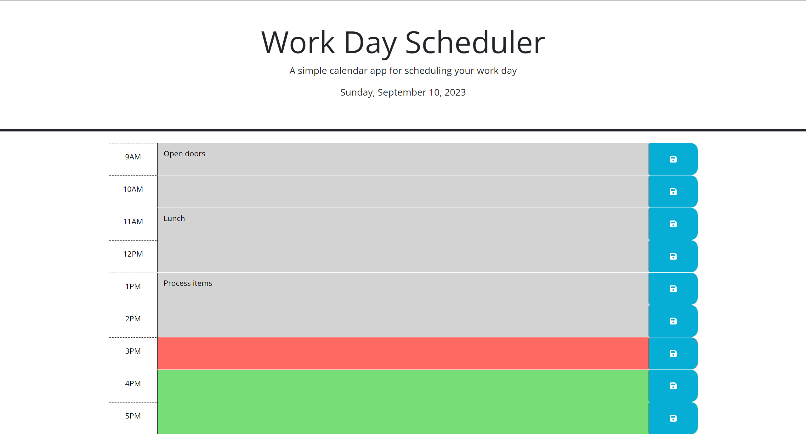

# WorkFlow-Pro
## User Story

```md
AS AN employee with a busy schedule
I WANT to add important events to a daily planner
SO THAT I can manage my time effectively
```

## Acceptance Criteria

```md
GIVEN I am using a daily planner to create a schedule
WHEN I open the planner
THEN the current day is displayed at the top of the calendar
WHEN I scroll down
THEN I am presented with timeblocks for standard business hours of 9am-5pm
WHEN I view the timeblocks for that day
THEN each timeblock is color coded to indicate whether it is in the past, present, or future
WHEN I click into a timeblock
THEN I can enter an event
WHEN I click the save button for that timeblock
THEN the text for that event is saved in local storage
WHEN I refresh the page
THEN the saved events persist
```

## Objective

Provided with the template to an HTML and CSS code, using jQuery, create
functionality to a work schedule page, where once the user clicks save
after entering in text to a textfield (whether it is before, in
between, or after 9am-5pm), the entered text will yet remain after
refreshing the page. There will be different timeblocks for past,
present, and future, and while this is all done using Day.js, the
current date will also be displayed at the top of the page.



## Link to Website

https://dcollan.github.io/work-day-scheduler/

## How to Run

1. Run 'git clone (repo link)' on Git Bash'
2. CD into project directory
3. Run project via code editor (e.g. Visual Studio Code)
4. Navigate to index.html
5. Right click on file, and click 'Open in Default Browser' to view project in browser
